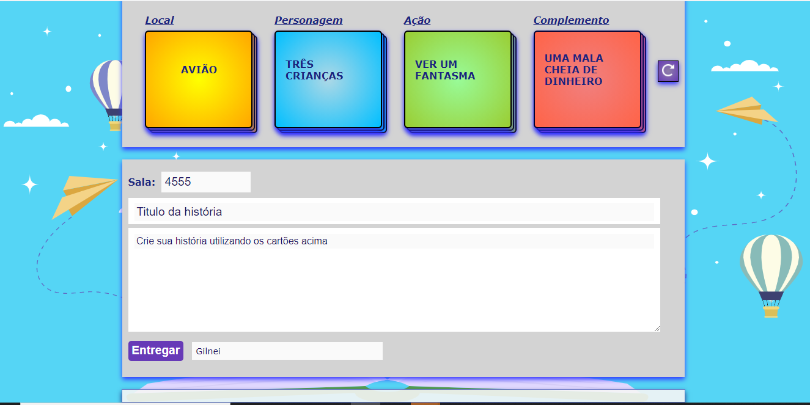
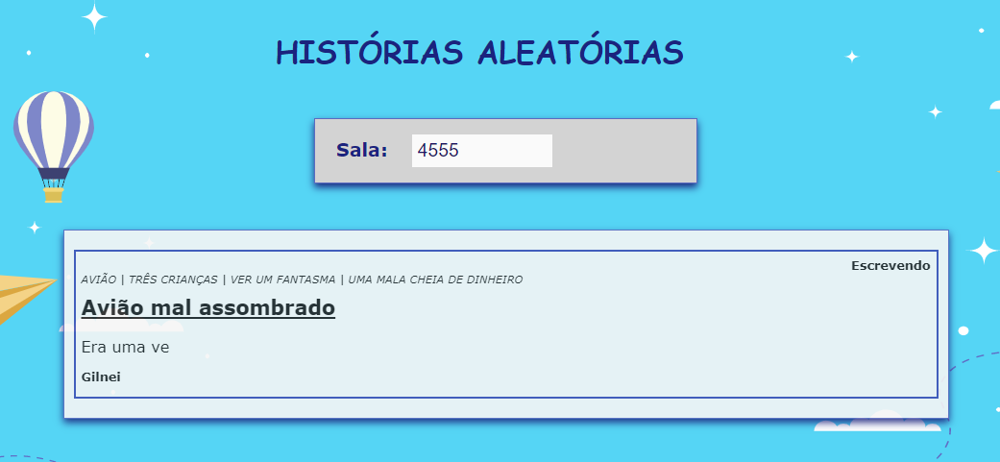

<h1 align="center">
  Gerador de Histórias
   <i>Histories Generator</i>
</h1>

<a href="#-developer">Developer</a>&nbsp;&nbsp;&nbsp;|&nbsp;&nbsp;&nbsp; 
<a href="#-About">About</a>&nbsp;&nbsp;&nbsp;|&nbsp;&nbsp;&nbsp;
<a href="#-tech">Technologies</a>&nbsp;&nbsp;&nbsp;|&nbsp;&nbsp;&nbsp;
<a href="#-license">License</a>

## 👨‍💻 Developer

I'm programmer and system's analist and work at Brazilian company. My Linkedin profile can be found <a href="https://www.linkedin.com/in/gilneirisso/">here</a>.

## 💻 About

Gerador de histórias é um projeto que visa desenvolver a leitura e produção textual de forma lúdica e criativa.
 Constitui-se numa página para o estudante, na qual ele informa seu nome e o número da sala gerada na página do professor. Quatro cartas aleatórias são sorteadas para ele produzir um texto. Ao final, poderá entregar a tarefa.

A página do professor apresenta um número de sala, o qual os estudantes devem informar na sua identificação. Nessa página, podem ser acompanhados os textos que estão sendo produzidos em tempo real ou entregues. 

Professores e estudantes, o projeto está pulicado e pode ser acessado nos links abaixo.
 Você pode acessar a página do aluno clicando <a href="https://historias-aleatorias.herokuapp.com/">aqui</a>.
 Você pode acessar a página do professor clicando <a href="https://historias-aleatorias.herokuapp.com/teacher">aqui</a>.

## 🚀 Technologies
This project was developed with this technologies:

- **[ReactJS](https://developer.mozilla.org/en-US/docs/Glossary/HTML)**
- **[package socket.io](https://www.npmjs.com/package/socket.io)**

## 🖊️ License
The project is licensed under the "MIT License" - See the LICENSE page for more details.
